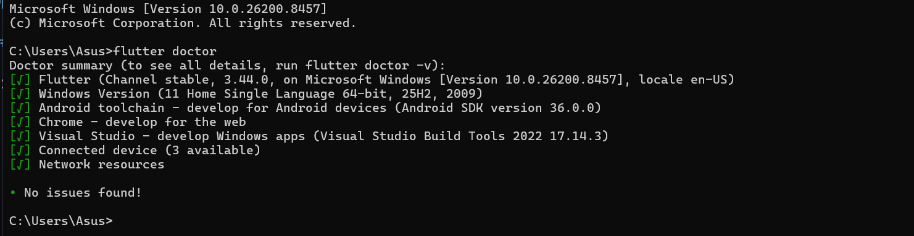
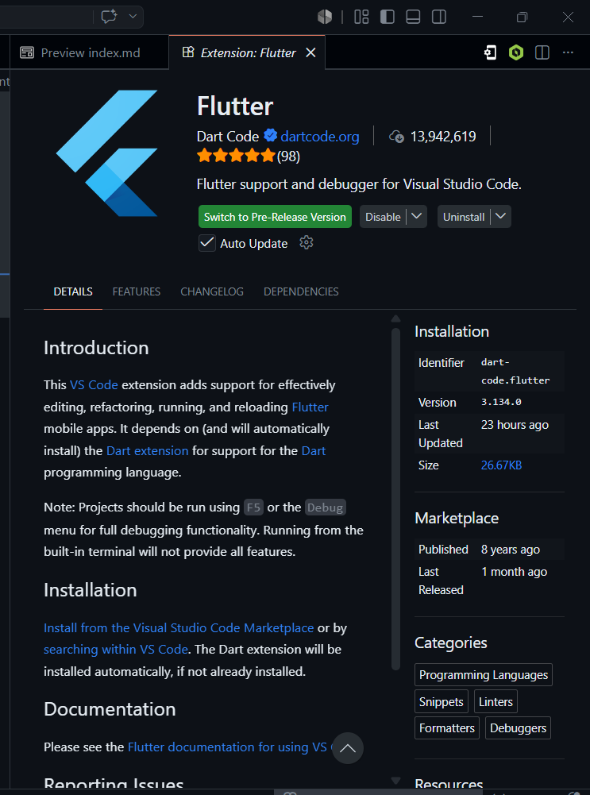
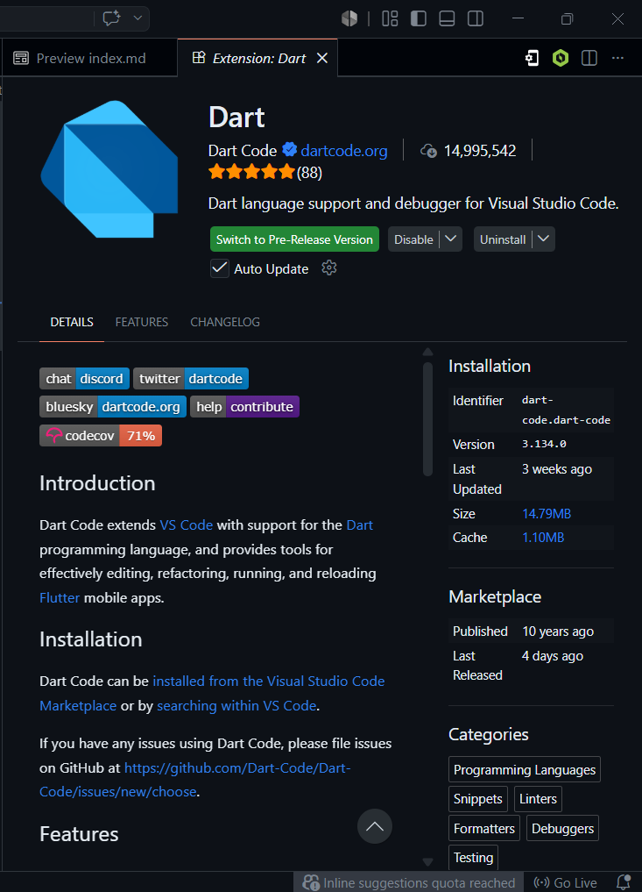
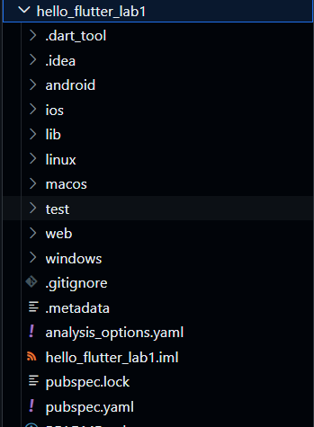
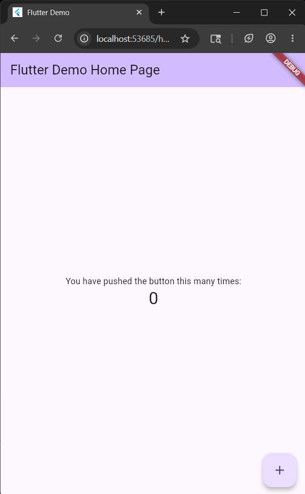
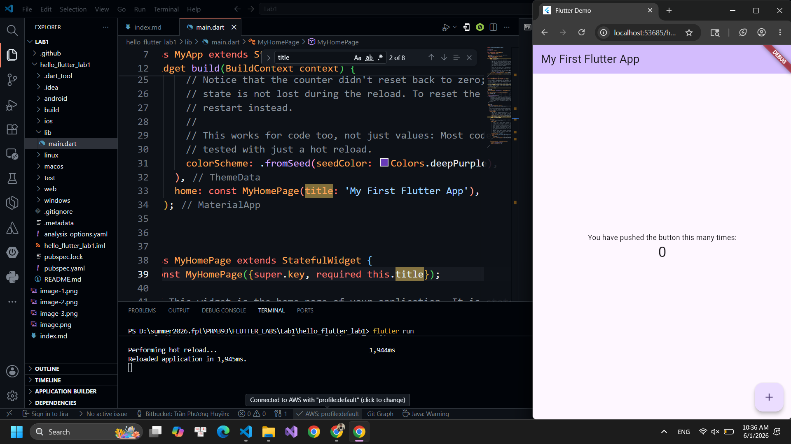
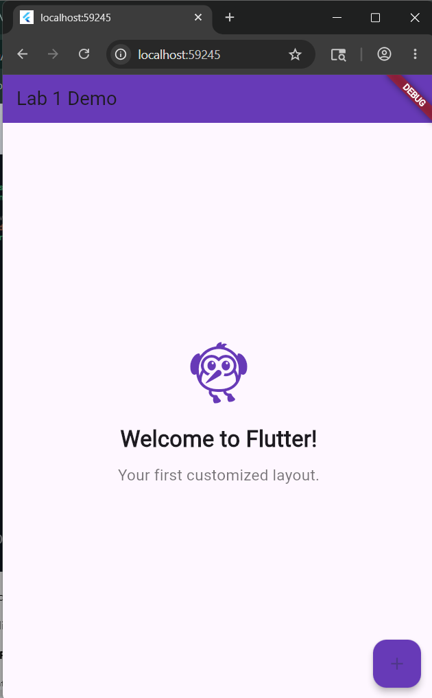

## Lab 1 : Setting Up Flutter and Running Your First App

### Task 1: Flutter Environment Setup

**1. Requirements:**
 - Install and verify Flutter tools.
 - Steps: 
    + Install Flutter SDK.
    + Add Flutter to PATH.
    + Run: flutter doctor
    + Ensure all items are properly configured.
    + Verify Flutter & Dart plugins in Android Studio.

**2. Screenshots:**

- Install Flutter SDK 

- Add Flutter to PATH

- Run: flutter doctor 
    

- Verify Flutter & Dart plugins in VS Code
    
    

---

### Task 2:  Create and Run Your First Flutter App

**1. Requirements:**
- Learn how to create a Flutter project and run the default app.
- Steps: 
    + Open Android Studio → New Flutter Project
    + Use project name: hello_flutter_lab1
    + Explore key folders: lib/, android/, ios/, pubspec.yaml
    + Start emulator or connect device
    + Run the default counter app
    + Modify the AppBar title in main.dart, title: 'My First Flutter App',
    + Use Hot Reload and observe changes

**2. Screenshots:**
-  Project structure

    

- Running counter app

    

- Updated title via Hot Reload

    
---
### Task 3: Customize First Flutter UI
**1. Requirements:** 
- Build a simple custom UI with widgets learned in class.
- Step: 
    + Replace default code in main.dart
    + Perform Hot Reload and verify UI updates
    + Modify colors/text and reload again

**2. Screenshots:**

- UI Modified: 

    

---
### Task 4: Reflection Questions

1. What is the purpose of the flutter doctor command?
   > The purpose of the 'flutter doctor' command is to diagnose and verify the health of local Flutter development environment. 

2. What file acts as the entry point of a Flutter application?
   > The lib/main.dart file acts as the default entry point of a Flutter application.

3. Explain the difference between Hot Reload and Hot Restart.
   > The differences are: Hot Reload preserves application state wwhile injecting code updates, while Hot Restart destroys the state and completely resets the application to its initial loading conditions. 
4. How does runApp() build the widget tree?
   > The runApp() function builds the widget tree by inflating the root widget passed into it and attaching it to the screen.  
5. Describe how Flutter’s architecture enables cross-platform development.
   > Flutter's architecture enables cross-platform development by bypassing native platform UI components and instead rendering every pixel directly onto a blank screen canvas using its own high-performance graphics engine. 

